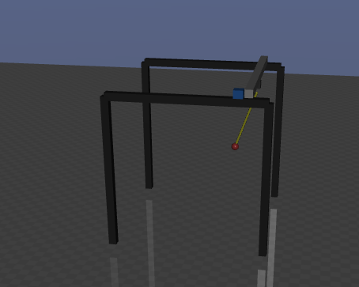

## Overview

This repository contains **Assignment 2** of the 2025/2026 _Laboratorio di Automatica_ course at the [_Università degli Studi di Brescia_](https://www.unibs.it/it). The authors decline any responsibility for usage outside this scope. The provided tools support the development, simulation, and implementation of control systems for mechatronic applications. Developed by [CARI JRL](https://cari.unibs.it/).

> You need to install [labauto_control_library](https://github.com/JRL-CARI-CNR-UNIBS/labauto_control_library/tree/master) and activate the Conda environment before using this repository.

## Assignment goal

The goal of this assignment is to move a **crane** while **reducing oscillations** by using an **input shaper**.

Students must implement **at least one** input shaper among the following:

- **ZV** (Zero Vibration)
- **ZVD** (Zero Vibration Derivative)
- **ZVDD**
- **EI** (Extra Insensitive)

The purpose is to reshape the reference command so that the oscillatory dynamics of the crane are excited as little as possible during motion.



## Main task

The main script of the repository is:

- **`robot_simulation.py`** — runs the simulation and must be modified to introduce the input shaper.

The student is expected to:

1. understand how the motion command is generated and applied in simulation
2. implement at least one input shaper
3. integrate the input shaper into the simulation workflow
4. evaluate the reduction of oscillations produced by the shaped command

## Repository scope

This assignment focuses on **command shaping**, not on redesigning the whole control architecture.

The simulation infrastructure is already provided. In most cases, the required work is limited to the implementation and integration of the input shaper inside `robot_simulation.py`.

## Suggested repository contents

The repository typically contains:

- `robot_simulation.py` — main simulation script
- simulation, model, and configuration files needed by the MuJoCo environment
- robot description files and parameters
- support files that normally do not require modification

## Required implementation

Students must implement an input shaper that modifies the commanded input through a sequence of delayed and weighted impulses.

Possible choices include:

### ZV

The simplest input shaper, designed to cancel residual vibration for a nominal oscillation frequency and damping ratio.

### ZVD

A more robust version of ZV, with improved sensitivity to modeling errors.

### ZVDD

An extension of ZVD with additional robustness.

### EI

An extra-insensitive shaper that further improves robustness to uncertainty in the oscillatory mode.

At least one of these shapers must be implemented and used in the simulation.

## Provided simulation wrapper

The repository includes a MuJoCo-based mechanical-system wrapper.

Its purpose is to:

- load the MuJoCo model
- manage actuators and joints
- run the physics simulation
- provide measurements to the control logic
- optionally visualize the simulation through `mujoco.viewer`

The wrapper already handles:

- model loading
- actuator force application
- sensor reading
- simulation stepping
- optional viewer support
- platform-specific viewer checks, especially on macOS

This infrastructure should normally be reused as provided.

## macOS note

On macOS, the MuJoCo viewer requires `mjpython`.

Run scripts with:

```bash
mjpython robot_simulation.py
```

instead of:

```bash
python robot_simulation.py
```

when interactive visualization is enabled.

## Installation

This repository depends on `labauto_control_library`.

Follow the installation instructions in the main library repository:

- [labauto_control_library](https://github.com/JRL-CARI-CNR-UNIBS/labauto_control_library/tree/master)

In summary:

1. create and activate the Conda environment required by `labauto_control_library`
2. install all the required dependencies
3. install or update the library from GitHub
4. run this assignment repository from the active environment

## Running the simulation

After activating the Conda environment, launch the simulation from the repository root:

```bash
python robot_simulation.py
```

On macOS, use:

```bash
mjpython robot_simulation.py
```

if the MuJoCo viewer is enabled.

## What the student should modify

The main required modification is in:

- **`robot_simulation.py`**

This file must be extended to include the selected input shaper (implemented as a class).


A typical implementation workflow is:

1. identify the oscillatory mode to be attenuated
2. choose a shaper type
3. shape the reference command before it is sent to the crane
4. compare the response with and without shaping

## Expected student activity

For this assignment, students are mainly expected to:

- understand the oscillatory behavior of the crane
- study the principle of input shaping
- implement one valid input shaper
- integrate it into the simulation
- evaluate its effectiveness in reducing residual oscillations

## Notes on implementation

When implementing the input shaper, pay attention to:

- the oscillation frequency used to design the shaper
- the damping ratio assumption
- the delay introduced by the shaping process
- the trade-off between vibration reduction and execution speed
- robustness with respect to modeling uncertainty

A more robust shaper usually reduces oscillation more reliably, but it may also introduce a larger delay.

## Notes

- Use a clean Conda environment.
- Do not source ROS in the same terminal when using the Conda environment, since dependency clashes may occur.
- Unless explicitly required, do not modify the simulation model files.
- Focus on the shaping logic and on the comparison between shaped and unshaped commands.

## Educational objective

This assignment is intended to introduce students to a classical feedforward vibration-reduction technique widely used in flexible and oscillatory systems.

By the end of the assignment, students should be able to:

- explain the rationale behind input shaping
- implement at least one standard shaper
- integrate the shaper into a simulation workflow
- discuss the benefits and limitations of the chosen shaping strategy
